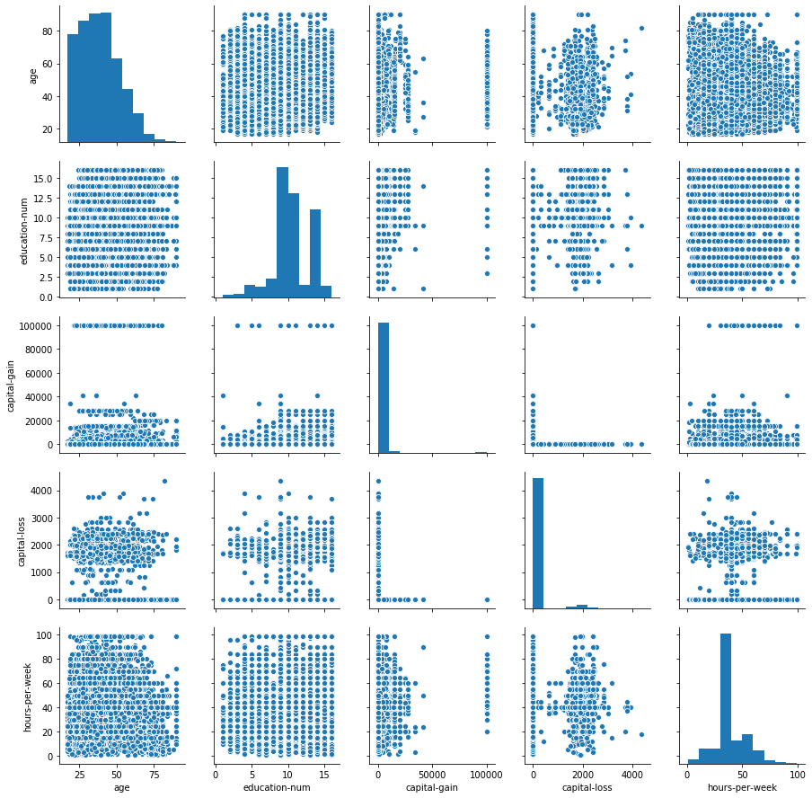
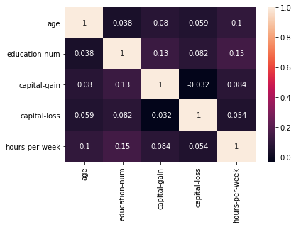
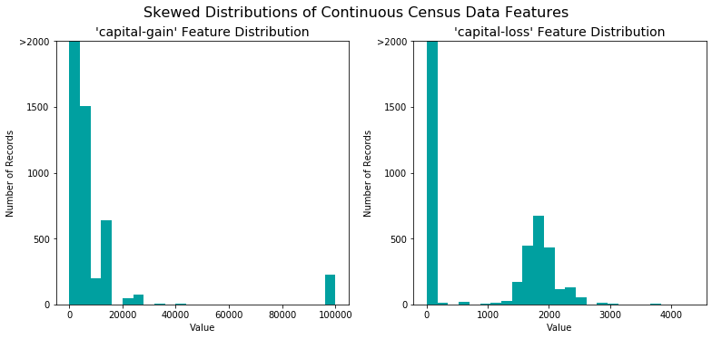
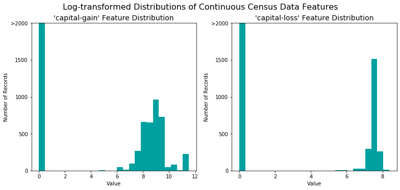
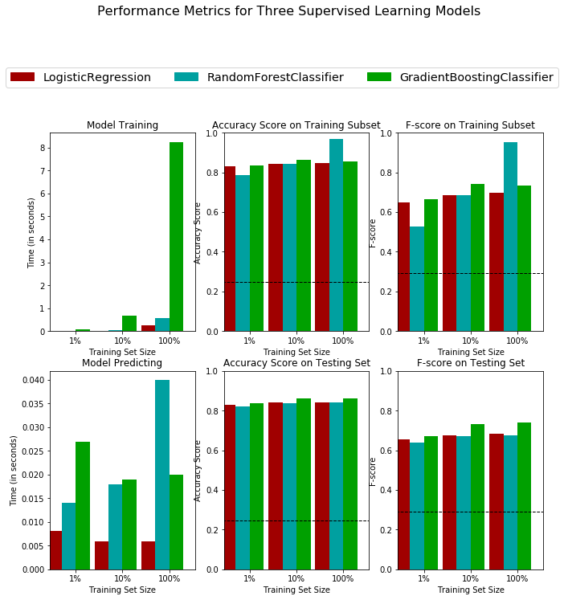
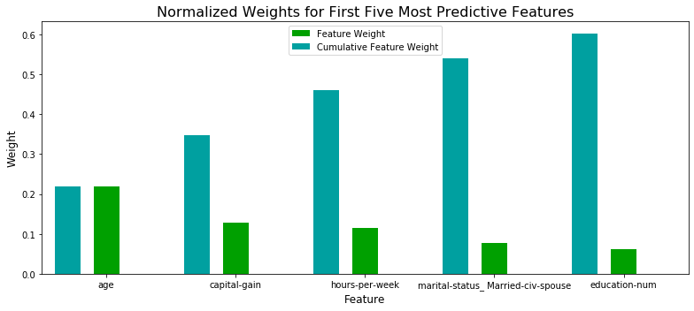

# Project: Finding Donors for *CharityML*

## Getting Started

In this project, I will employ several supervised algorithms to model individuals' income using data collected from the 1994 U.S. Census. I will choose the best candidate algorithm from preliminary results and further optimize this algorithm to best model the data. My goal with this implementation is to construct a model that accurately predicts whether an individual makes more than $50,000. Understanding an individual's income can help a non-profit better understand how large of a donation to request, or whether or not they should reach out to begin with.  

The dataset for this project originates from the [UCI Machine Learning Repository](https://archive.ics.uci.edu/ml/datasets/Census+Income). 

# Table of Contents 
1. [Exploring the Data](#eda)    
    1.1 [Pairplot of Numerical Variables](#pairplot)    
    1.2 [Correlation Matrix](#corr)    
    1.3 [Outcome and Feature Exploration](#outcome)    
2. [Preprocessing the Data](#preprocess)      
    2.1 [Transforming Skewed Continuous Features](#skew)     
    2.2 [Normalizing Numerical Features](#normal)    
    2.3 [Encoding Categorical Variables](#encode)    
    2.4 [Shuffle and Split Data](#split)
3. [Model Training and Evaluation](#train)    
    3.1 [Naive Predictor Performace](#naive)    
    3.2 [Pros and Cons of Models](#pro)    
    3.3 [Creating a Training and Predicting Pipeline](#pipeline)    
    3.4 [Initial Model Evaluation](#initial)    
    3.5 [Choosing the Best Model](#best)
4. [Improving the Results](#improve)    
    4.1 [Hyperparameter Tuning](#hyper)    
    4.2 [Final Model Evaluation](#final)
5. [Feature Importance](#important)     
    5.1 [Feature Relevance Observation](#feat_obs)    
    5.2 [Extracting Feature Importance](#feat_imp)    
    5.3 [Training on the Reduced Feature Space](#feat_reduce)

----
## 1. Exploring the Data<a id="eda"></a>

Run the code cell below to load necessary Python libraries and load the census data. Note that the last column from this dataset, `'income'`, will be our target label (whether an individual makes more than, or at most, $50,000 annually). All other columns are features about each individual in the census database.


```python
# Hide all warnings
import warnings
warnings.filterwarnings('ignore')

# Import libraries necessary for this project
import numpy as np
import pandas as pd
from time import time
from IPython.display import display # Allows the use of display() for DataFrames

# Import supplementary visualization code visuals.py
import visuals as vs

# Pretty display for notebooks
%matplotlib inline

# Load the Census dataset
data = pd.read_csv("census.csv")

# Display the first record
display(data.head(n=1))
```


<div>
<style scoped>
    .dataframe tbody tr th:only-of-type {
        vertical-align: middle;
    }

    .dataframe tbody tr th {
        vertical-align: top;
    }

    .dataframe thead th {
        text-align: right;
    }
</style>
<table border="1" class="dataframe">
  <thead>
    <tr style="text-align: right;">
      <th></th>
      <th>age</th>
      <th>workclass</th>
      <th>education_level</th>
      <th>education-num</th>
      <th>marital-status</th>
      <th>occupation</th>
      <th>relationship</th>
      <th>race</th>
      <th>sex</th>
      <th>capital-gain</th>
      <th>capital-loss</th>
      <th>hours-per-week</th>
      <th>native-country</th>
      <th>income</th>
    </tr>
  </thead>
  <tbody>
    <tr>
      <th>0</th>
      <td>39</td>
      <td>State-gov</td>
      <td>Bachelors</td>
      <td>13.0</td>
      <td>Never-married</td>
      <td>Adm-clerical</td>
      <td>Not-in-family</td>
      <td>White</td>
      <td>Male</td>
      <td>2174.0</td>
      <td>0.0</td>
      <td>40.0</td>
      <td>United-States</td>
      <td>&lt;=50K</td>
    </tr>
  </tbody>
</table>
</div>


```python
# Check out data shape
print(data.shape)
```

    (45222, 14)
    

### 1.1 Pairplot of Numerical Variables<a id="pairplot"></a>


```python
# Check out the (joint) distribution of numerical variables
import seaborn as sns
import matplotlib.pyplot as plt
sns.pairplot(data)
plt.show()
```





### 1.2 Correlation Matrix<a id="corr"></a>


```python
# Check the correlation between them
sns.heatmap(data.corr(),annot=True)
plt.show()
```





### 1.3 Outcome and Feature Exploration<a id="outcome"></a>


```python
# Total number of records
n_records = data.shape[0]

# Number of records where individual's income is more than $50,000
n_greater_50k = data.income.value_counts()[1]

# Number of records where individual's income is at most $50,000
n_at_most_50k = data.income.value_counts()[0]

# Percentage of individuals whose income is more than $50,000
greater_percent = n_greater_50k / n_records * 100

# Print the results
print("Total number of records: {}".format(n_records))
print("Individuals making more than $50,000: {}".format(n_greater_50k))
print("Individuals making at most $50,000: {}".format(n_at_most_50k))
print("Percentage of individuals making more than $50,000: {:.2f}%".format(greater_percent))
```

    Total number of records: 45222
    Individuals making more than $50,000: 11208
    Individuals making at most $50,000: 34014
    Percentage of individuals making more than $50,000: 24.78%
    

**Features**

* **age**: continuous. 
* **workclass**: Private, Self-emp-not-inc, Self-emp-inc, Federal-gov, Local-gov, State-gov, Without-pay, Never-worked. 
* **education**: Bachelors, Some-college, 11th, HS-grad, Prof-school, Assoc-acdm, Assoc-voc, 9th, 7th-8th, 12th, Masters, 1st-4th, 10th, Doctorate, 5th-6th, Preschool. 
* **education-num**: continuous. 
* **marital-status**: Married-civ-spouse, Divorced, Never-married, Separated, Widowed, Married-spouse-absent, Married-AF-spouse. 
* **occupation**: Tech-support, Craft-repair, Other-service, Sales, Exec-managerial, Prof-specialty, Handlers-cleaners, Machine-op-inspct, Adm-clerical, Farming-fishing, Transport-moving, Priv-house-serv, Protective-serv, Armed-Forces. 
* **relationship**: Wife, Own-child, Husband, Not-in-family, Other-relative, Unmarried. 
* **race**: Black, White, Asian-Pac-Islander, Amer-Indian-Eskimo, Other. 
* **sex**: Female, Male. 
* **capital-gain**: continuous. 
* **capital-loss**: continuous. 
* **hours-per-week**: continuous. 
* **native-country**: United-States, Cambodia, England, Puerto-Rico, Canada, Germany, Outlying-US(Guam-USVI-etc), India, Japan, Greece, South, China, Cuba, Iran, Honduras, Philippines, Italy, Poland, Jamaica, Vietnam, Mexico, Portugal, Ireland, France, Dominican-Republic, Laos, Ecuador, Taiwan, Haiti, Columbia, Hungary, Guatemala, Nicaragua, Scotland, Thailand, Yugoslavia, El-Salvador, Trinadad&Tobago, Peru, Hong, Holand-Netherlands.

----
## 2. Preprocessing the Data<a id="preprocess"></a>

### 2.1 Transforming Skewed Continuous Features<a id="skew"></a>
With the census dataset two features fit this description: '`capital-gain'` and `'capital-loss'`. 
Run the code cell below to plot a histogram of these two features.


```python
# Split the data into features and target label
income_raw = data['income']
features_raw = data.drop('income', axis = 1)

# Visualize skewed continuous features of original data
vs.distribution(data)
```





Perform a transformation on the data so that the very large and very small values do not negatively affect the performance of a learning algorithm. Using a logarithmic transformation significantly reduces the range of values caused by outliers. Care must be taken when applying this transformation: The logarithm of `0` is undefined, so we must translate the values by a small amount above `0` to apply the the logarithm successfully.


```python
# Log-transform the skewed features
skewed = ['capital-gain', 'capital-loss']
features_log_transformed = pd.DataFrame(data = features_raw)
features_log_transformed[skewed] = features_raw[skewed].apply(lambda x: np.log(x + 1))

# Visualize the new log distributions
vs.distribution(features_log_transformed, transformed = True)
```





### 2.2 Normalizing Numerical Features<a id="normal"></a>
Normalization ensures that each feature is treated equally when applying supervised learners. Note that once scaling is applied, observing the data in its raw form will no longer have the same original meaning, as exampled below.
Run the code cell below to normalize each numerical feature. [`sklearn.preprocessing.MinMaxScaler`](http://scikit-learn.org/stable/modules/generated/sklearn.preprocessing.MinMaxScaler.html) will be used for this.


```python
# Import sklearn.preprocessing.StandardScaler
from sklearn.preprocessing import MinMaxScaler

# Initialize a scaler, then apply it to the features
scaler = MinMaxScaler() # default=(0, 1)
numerical = ['age', 'education-num', 'capital-gain', 'capital-loss', 'hours-per-week']

features_log_minmax_transform = pd.DataFrame(data = features_log_transformed)
features_log_minmax_transform[numerical] = scaler.fit_transform(features_log_transformed[numerical])

# Show an example of a record with scaling applied
display(features_log_minmax_transform.head(n = 5))
```


<div>
<style scoped>
    .dataframe tbody tr th:only-of-type {
        vertical-align: middle;
    }

    .dataframe tbody tr th {
        vertical-align: top;
    }

    .dataframe thead th {
        text-align: right;
    }
</style>
<table border="1" class="dataframe">
  <thead>
    <tr style="text-align: right;">
      <th></th>
      <th>age</th>
      <th>workclass</th>
      <th>education_level</th>
      <th>education-num</th>
      <th>marital-status</th>
      <th>occupation</th>
      <th>relationship</th>
      <th>race</th>
      <th>sex</th>
      <th>capital-gain</th>
      <th>capital-loss</th>
      <th>hours-per-week</th>
      <th>native-country</th>
    </tr>
  </thead>
  <tbody>
    <tr>
      <th>0</th>
      <td>0.301370</td>
      <td>State-gov</td>
      <td>Bachelors</td>
      <td>0.800000</td>
      <td>Never-married</td>
      <td>Adm-clerical</td>
      <td>Not-in-family</td>
      <td>White</td>
      <td>Male</td>
      <td>0.667492</td>
      <td>0.0</td>
      <td>0.397959</td>
      <td>United-States</td>
    </tr>
    <tr>
      <th>1</th>
      <td>0.452055</td>
      <td>Self-emp-not-inc</td>
      <td>Bachelors</td>
      <td>0.800000</td>
      <td>Married-civ-spouse</td>
      <td>Exec-managerial</td>
      <td>Husband</td>
      <td>White</td>
      <td>Male</td>
      <td>0.000000</td>
      <td>0.0</td>
      <td>0.122449</td>
      <td>United-States</td>
    </tr>
    <tr>
      <th>2</th>
      <td>0.287671</td>
      <td>Private</td>
      <td>HS-grad</td>
      <td>0.533333</td>
      <td>Divorced</td>
      <td>Handlers-cleaners</td>
      <td>Not-in-family</td>
      <td>White</td>
      <td>Male</td>
      <td>0.000000</td>
      <td>0.0</td>
      <td>0.397959</td>
      <td>United-States</td>
    </tr>
    <tr>
      <th>3</th>
      <td>0.493151</td>
      <td>Private</td>
      <td>11th</td>
      <td>0.400000</td>
      <td>Married-civ-spouse</td>
      <td>Handlers-cleaners</td>
      <td>Husband</td>
      <td>Black</td>
      <td>Male</td>
      <td>0.000000</td>
      <td>0.0</td>
      <td>0.397959</td>
      <td>United-States</td>
    </tr>
    <tr>
      <th>4</th>
      <td>0.150685</td>
      <td>Private</td>
      <td>Bachelors</td>
      <td>0.800000</td>
      <td>Married-civ-spouse</td>
      <td>Prof-specialty</td>
      <td>Wife</td>
      <td>Black</td>
      <td>Female</td>
      <td>0.000000</td>
      <td>0.0</td>
      <td>0.397959</td>
      <td>Cuba</td>
    </tr>
  </tbody>
</table>
</div>


### 2.3 Encoding Categorical Variables<a id="encode"></a>

Convert categorical variables using the **one-hot encoding** scheme and encode two categories of the target label, `'income'` ("<=50K " and ">50K"), as `0` and `1`, respectively.


```python
# One-hot encode the 'features_log_minmax_transform' data using pandas.get_dummies()
features_final = pd.get_dummies(features_log_minmax_transform)

# Encode the 'income_raw' data to numerical values
income = income_raw.map({'<=50K': 0, '>50K': 1})

# Print the number of features after one-hot encoding
encoded = list(features_final.columns)
print("{} total features after one-hot encoding.".format(len(encoded)))

# See the encoded feature names
print(encoded)
```

    103 total features after one-hot encoding.
    ['age', 'education-num', 'capital-gain', 'capital-loss', 'hours-per-week', 'workclass_ Federal-gov', 'workclass_ Local-gov', 'workclass_ Private', 'workclass_ Self-emp-inc', 'workclass_ Self-emp-not-inc', 'workclass_ State-gov', 'workclass_ Without-pay', 'education_level_ 10th', 'education_level_ 11th', 'education_level_ 12th', 'education_level_ 1st-4th', 'education_level_ 5th-6th', 'education_level_ 7th-8th', 'education_level_ 9th', 'education_level_ Assoc-acdm', 'education_level_ Assoc-voc', 'education_level_ Bachelors', 'education_level_ Doctorate', 'education_level_ HS-grad', 'education_level_ Masters', 'education_level_ Preschool', 'education_level_ Prof-school', 'education_level_ Some-college', 'marital-status_ Divorced', 'marital-status_ Married-AF-spouse', 'marital-status_ Married-civ-spouse', 'marital-status_ Married-spouse-absent', 'marital-status_ Never-married', 'marital-status_ Separated', 'marital-status_ Widowed', 'occupation_ Adm-clerical', 'occupation_ Armed-Forces', 'occupation_ Craft-repair', 'occupation_ Exec-managerial', 'occupation_ Farming-fishing', 'occupation_ Handlers-cleaners', 'occupation_ Machine-op-inspct', 'occupation_ Other-service', 'occupation_ Priv-house-serv', 'occupation_ Prof-specialty', 'occupation_ Protective-serv', 'occupation_ Sales', 'occupation_ Tech-support', 'occupation_ Transport-moving', 'relationship_ Husband', 'relationship_ Not-in-family', 'relationship_ Other-relative', 'relationship_ Own-child', 'relationship_ Unmarried', 'relationship_ Wife', 'race_ Amer-Indian-Eskimo', 'race_ Asian-Pac-Islander', 'race_ Black', 'race_ Other', 'race_ White', 'sex_ Female', 'sex_ Male', 'native-country_ Cambodia', 'native-country_ Canada', 'native-country_ China', 'native-country_ Columbia', 'native-country_ Cuba', 'native-country_ Dominican-Republic', 'native-country_ Ecuador', 'native-country_ El-Salvador', 'native-country_ England', 'native-country_ France', 'native-country_ Germany', 'native-country_ Greece', 'native-country_ Guatemala', 'native-country_ Haiti', 'native-country_ Holand-Netherlands', 'native-country_ Honduras', 'native-country_ Hong', 'native-country_ Hungary', 'native-country_ India', 'native-country_ Iran', 'native-country_ Ireland', 'native-country_ Italy', 'native-country_ Jamaica', 'native-country_ Japan', 'native-country_ Laos', 'native-country_ Mexico', 'native-country_ Nicaragua', 'native-country_ Outlying-US(Guam-USVI-etc)', 'native-country_ Peru', 'native-country_ Philippines', 'native-country_ Poland', 'native-country_ Portugal', 'native-country_ Puerto-Rico', 'native-country_ Scotland', 'native-country_ South', 'native-country_ Taiwan', 'native-country_ Thailand', 'native-country_ Trinadad&Tobago', 'native-country_ United-States', 'native-country_ Vietnam', 'native-country_ Yugoslavia']
    

### 2.4 Shuffle and Split Data<a id="split"></a>
Split the data (both features and their labels) into training and test sets. 80% of the data will be used for training and 20% for testing.


```python
# Import train_test_split
from sklearn.model_selection import train_test_split

# Split the 'features' and 'income' data into training and testing sets
X_train, X_test, y_train, y_test = train_test_split(features_final, 
                                                    income, 
                                                    test_size = 0.2, 
                                                    random_state = 0)

# Show the results of the split
print("Training set has {} samples.".format(X_train.shape[0]))
print("Testing set has {} samples.".format(X_test.shape[0]))
```

    Training set has 36177 samples.
    Testing set has 9045 samples.
    

#### Chi-Square Test<a id="chi2"></a>


```python
# Perform Chi-Square Test on the data to check which features are not independent from the income
from sklearn.feature_selection import chi2

# Get chi-square values
chi2_raw = chi2(features_final,income)[0]

# Get the 10 features with largest chi-square values
features_final.columns[np.argsort(chi2_raw)][::-1][:10]
```


    Index(['marital-status_ Married-civ-spouse', 'relationship_ Husband',
           'marital-status_ Never-married', 'capital-gain',
           'relationship_ Own-child', 'occupation_ Exec-managerial', 'sex_ Female',
           'occupation_ Prof-specialty', 'relationship_ Not-in-family',
           'education_level_ Masters'],
          dtype='object')


----
## 3. Model Training and Evaluation<a id="train"></a>

### 3.1 Naive Predictor Performace<a id="naive"></a>
* If we chose a model that always predicted an individual made more than $50,000, what would  that model's accuracy and F-score be on this dataset? The the purpose of generating a naive predictor is simply to show what a base model without any intelligence would look like. 


```python
'''
TP = np.sum(income) # Counting the ones as this is the naive case. Note that 'income' is the 'income_raw' data 
encoded to numerical values done in the data preprocessing step.
FP = income.count() - TP # Specific to the naive case

TN = 0 # No predicted negatives in the naive case
FN = 0 # No predicted negatives in the naive case
'''
# Calculate accuracy, precision and recall
accuracy = np.mean(income)
recall = 1
precision = accuracy

# Calculate F-score for beta = 0.5 
fscore = (1 + 0.5**2) * precision * recall / (0.5**2 * precision + recall)

# Print the results 
print("Naive Predictor: [Accuracy score: {:.4f}, F-score: {:.4f}]".format(accuracy, fscore))
```

    Naive Predictor: [Accuracy score: 0.2478, F-score: 0.2917]
    

### 3.2 Pros and Cons of Models<a id="pro"></a>
#### Here are three of the supervised learning models that I will test on the census data:

#### Model1: Logistic Regression

* This model can be used to predict whether a tumor is malignant or not.
* Strengths of the model: 
    * Outputs have a nice probability interpretation;
    * Does not require hyperparameter tuning;
    * fast and efficient;
    * can be regularized to avoid overfitting;
    * If the signal to noise ratio is low (it is a 'hard' problem) logistic regression is likely to perform best;
* Weaknesses of the model:
    * Feature engineering plays an important role to the performance of the model. Unrelated and highly correlated variables will affect its performance;
    * It tends to underperform when there are multiple or non-linear decision boundaries;
    * It is not flexible enough to naturally capture more complex relationships;
* This problem is a binary classification problem, with no (apparent) highly correlated features. Therefore, Logistic regression seems to be a quick and easy model to fit the data, serving as a benchmark for more complex models.

##### Reference
1. [What Are The Advantages Of Logistic Regression Over Decision Trees?](https://www.forbes.com/sites/quora/2017/06/19/what-are-the-advantages-of-logistic-regression-over-decision-trees/#41a5d0502c35)
2. [Real world implementation of Logistic Regression](https://towardsdatascience.com/real-world-implementation-of-logistic-regression-5136cefb8125)
3. [Modern Machine Learning Algorithms: Strengths and Weaknesses](https://elitedatascience.com/machine-learning-algorithms)

#### Model2: Random Forest

* This model can be used in the the banking sector. For example, it can be used to determine whether a customer is a fraud or not.
* Strengths of the model: 
    * The computation can be parallelized and thus very fast;
    * It can handle large datasets with high dimensionality;
    * It is robust to missing data;
    * It will output importances of features and thus can be used for feature engineering;
    * It can deal with unbalanced data;
* Weaknesses of the model:
    * When used for regression, this model cannot predict beyond the range of the training data;
    * It may overfit datasets that are particularly noisy;
    * It has low interpretability;
* Random forest is a popular model which generally has good performance on classification problems. It works well with a mixture of numerical and categorical features. Compared with Logistic regression, it is more suitable for classification with multiple decision boundaries. In addition, it helps us identify the most significant features.

##### Reference
1. [A COMPLETE GUIDE TO THE RANDOM FOREST ALGORITHM](https://builtin.com/data-science/random-forest-algorithm#real)
2. [Why Random Forest is My Favorite Machine Learning Model](https://towardsdatascience.com/why-random-forest-is-my-favorite-machine-learning-model-b97651fa3706)
3. [A limitation of Random Forest Regression](https://towardsdatascience.com/a-limitation-of-random-forest-regression-db8ed7419e9f)

#### Model3: Gradient Boosting
* This model can be used in the field of learning to rank. Variants of gradient boosting are used in commercial web search engines Yahoo and Yandex.
* Strengths of the model: 
    * It supports different loss functions;
    * With carefully tuned parameters, it will perform very well and generally give better results than Random Forest;
    * Works well with interactions;
* Weaknesses of the model:
    * Cannot be implemented in parallel. Thus, it takes longer time to train;
    * It is prone to overfitting;
    * It requires careful tuning of different hyperparameters;
* This model is a different type of ensemble approach from Random Forest. It fully considers the weight of each classifier and builds models intelligently. It can learn complex non-linear decision boundaries. Thus, this model should be a good choice for this classification problem.

##### Reference
1. [Why does Gradient boosting work so well for so many Kaggle problems?](https://www.quora.com/Why-does-Gradient-boosting-work-so-well-for-so-many-Kaggle-problems)
2. [Understanding Gradient Boosting Machines](https://towardsdatascience.com/understanding-gradient-boosting-machines-9be756fe76ab)
3. [Gradient boosting Wikipedia](https://en.wikipedia.org/wiki/Gradient_boosting#Usage) 

### 3.3 Creating a Training and Predicting Pipeline<a id="pipeline"></a>
To properly evaluate the performance of each model, I created a training and predicting pipeline that allows me to quickly and effectively train models using various sizes of training data and perform predictions on the testing data. 


```python
# Import two metrics from sklearn - fbeta_score and accuracy_score
from sklearn.metrics import fbeta_score
from sklearn.metrics import accuracy_score

def train_predict(learner, sample_size, X_train, y_train, X_test, y_test): 
    '''
    inputs:
       - learner: the learning algorithm to be trained and predicted on
       - sample_size: the size of samples (number) to be drawn from training set
       - X_train: features training set
       - y_train: income training set
       - X_test: features testing set
       - y_test: income testing set
    '''
    
    results = {}
    
    # Fit the learner to the training data using slicing with 'sample_size' using .fit(training_features[:], training_labels[:])
    start = time() # Get start time
    X_train_sample = X_train.sample(sample_size)
    y_train_sample = y_train[X_train_sample.index]
    learner.fit(X_train_sample, y_train_sample)
    end = time() # Get end time
    
    # Calculate the training time
    results['train_time'] = end - start
        
    # Get the predictions on the test set(X_test),
    # then get predictions on the first 300 training samples(X_train) using .predict()
    start = time() # Get start time
    predictions_test = learner.predict(X_test)
    predictions_train = learner.predict(X_train[:300])
    end = time() # Get end time
    
    # Calculate the total prediction time
    results['pred_time'] = end -start
            
    # Compute accuracy on the first 300 training samples which is y_train[:300]
    results['acc_train'] = accuracy_score(y_train[:300], predictions_train)
        
    # Compute accuracy on test set using accuracy_score()
    results['acc_test'] = accuracy_score(y_test, predictions_test)
    
    # Compute F-score on the the first 300 training samples using fbeta_score()
    results['f_train'] = fbeta_score(y_train[:300], predictions_train, beta=0.5)
        
    # Compute F-score on the test set which is y_test
    results['f_test'] = fbeta_score(y_test, predictions_test, beta=0.5)
       
    # Success
    print("{} trained on {} samples.".format(learner.__class__.__name__, sample_size))
        
    # Return the results
    return results
```

### 3.4 Initial Model Evaluation<a id="initial"></a>


```python
# Import the three supervised learning models from sklearn
from sklearn.linear_model import LogisticRegression
from sklearn.ensemble import RandomForestClassifier
from sklearn.ensemble import GradientBoostingClassifier

# Initialize the three models
clf_A = LogisticRegression(random_state=314)
clf_B = RandomForestClassifier(random_state=314)
clf_C = GradientBoostingClassifier(random_state=314)

# Calculate the number of samples for 1%, 10%, and 100% of the training data
samples_100 = len(y_train)
samples_10 = int(len(y_train) * 0.1)
samples_1 = int(len(y_train) * 0.01)

# Collect results on the learners
results = {}
for clf in [clf_A, clf_B, clf_C]:
    clf_name = clf.__class__.__name__
    results[clf_name] = {}
    for i, samples in enumerate([samples_1, samples_10, samples_100]):
        results[clf_name][i] = \
        train_predict(clf, samples, X_train, y_train, X_test, y_test)

# Run metrics visualization for the three supervised learning models chosen
vs.evaluate(results, accuracy, fscore)
```

    LogisticRegression trained on 361 samples.
    LogisticRegression trained on 3617 samples.
    LogisticRegression trained on 36177 samples.
    RandomForestClassifier trained on 361 samples.
    RandomForestClassifier trained on 3617 samples.
    RandomForestClassifier trained on 36177 samples.
    GradientBoostingClassifier trained on 361 samples.
    GradientBoostingClassifier trained on 3617 samples.
    GradientBoostingClassifier trained on 36177 samples.
    





### 3.5 Choosing the Best Model<a id="best"></a>

Based on the above graph, I believe the gradient boosting model of the three models is most appropriate for the task of identifying individuals that make more than $50,000. This model gives the highest F<sub>0.5</sub> score on testing data when 100\% of the training set is used: 0.7395 (green bar in the lower right panel). Actually, this model performs best on testing data for all sampled training data. On the contrary, the random forest model ranks the third of three models when predicting on the testing set, despite its almost perfect (close to 1) accuracy and F<sub>0.5</sub> score on the training set. 

Although the gradient boosting model has the longest training time (green bar in the upper left panel), this shouldn't be a problem given the computing power of current technology. Besides, the training time is less than 8 seconds for about 36,000 data points, which is still a reasonable duration. This model also has a moderate prediction time (green bar in the lower left panel). 

### Describing the Model in Layman's Terms

Gradient boosting model works by combining a bunch of weak models sequentially and eventually getting a good model. The first weak model does its best to fit the data, but it still makes a lot of errors. So the second weak model tries to correct these errors. However, there are still errors left. So we fit a third model to try to correct those. This process is repeated for a reasonable number of times. Finally, we let these weak models to make a vote to get our ultimate strong model.
This is a classic case of "He who would do great things should not attempt them all alone &mdash; Seneca the Younger".

## 4. Improving the Results<a id="improve"></a>

### 4.1 Hyperparameter Tuning<a id="hyper"></a>


```python
# Import 'GridSearchCV', 'make_scorer', and any other necessary libraries
from sklearn.model_selection import GridSearchCV
from sklearn.metrics import make_scorer

# Initialize the classifier
clf = GradientBoostingClassifier(random_state=314)

# Create the parameters list
parameters = {'learning_rate':[0.01, 0.05, 0.1, 0.2, 0.3],
              'n_estimators':[100,200,400]}

# Make an fbeta_score scoring object using make_scorer()
scorer = make_scorer(fbeta_score, beta=0.5)

# Perform grid search on the classifier using 'scorer' as the scoring method using GridSearchCV()
grid_obj = GridSearchCV(clf, parameters, scoring=scorer)

# Fit the grid search object to the training data and find the optimal parameters using fit()
grid_fit = grid_obj.fit(X_train, y_train)

# Get the estimator
best_clf = grid_fit.best_estimator_

# Make predictions using the unoptimized and model
predictions = (clf.fit(X_train, y_train)).predict(X_test)
best_predictions = best_clf.predict(X_test)

# Report the before-and-afterscores
print("Unoptimized model\n------")
print("Accuracy score on testing data: {:.4f}".format(accuracy_score(y_test, predictions)))
print("F-score on testing data: {:.4f}".format(fbeta_score(y_test, predictions, beta = 0.5)))
print("\nOptimized Model\n------")
print("Final accuracy score on the testing data: {:.4f}".format(accuracy_score(y_test, best_predictions)))
print("Final F-score on the testing data: {:.4f}".format(fbeta_score(y_test, best_predictions, beta = 0.5)))
```

    Unoptimized model
    ------
    Accuracy score on testing data: 0.8630
    F-score on testing data: 0.7395
    
    Optimized Model
    ------
    Final accuracy score on the testing data: 0.8700
    Final F-score on the testing data: 0.7510
    


```python
# Check out the parameters of the best model
best_clf
```


    GradientBoostingClassifier(criterion='friedman_mse', init=None,
                               learning_rate=0.2, loss='deviance', max_depth=3,
                               max_features=None, max_leaf_nodes=None,
                               min_impurity_decrease=0.0, min_impurity_split=None,
                               min_samples_leaf=1, min_samples_split=2,
                               min_weight_fraction_leaf=0.0, n_estimators=200,
                               n_iter_no_change=None, presort='auto',
                               random_state=314, subsample=1.0, tol=0.0001,
                               validation_fraction=0.1, verbose=0,
                               warm_start=False)


### 4.2 Final Model Evaluation<a id="final"></a>

#### Results:

|     Metric     | Unoptimized Model | Optimized Model |
| :------------: | :---------------: | :-------------: | 
| Accuracy Score |      0.8630       |      0.8700     |
| F-score        |      0.7395       |      0.7510     |


Both the Accuracy score and F<sub>0.5</sub> score of the optimized model are greater than those of the unoptimized model, demonstrating that our hyperparameter tuning process is effective. These metrics are much greater than those in the naive predictor benchmarks.

----
## 5. Feature Importance<a id="important"></a>

By focusing on the relationship between only a few crucial features and the target label we simplify our understanding of the phenomenon, which is most always a useful thing to do. 

### 5.1 Feature Relevance Observation<a id="feat_obs"></a>

According to the [Chi-Square test](#chi2) for the one-hot encoded features and the outcome, the five most important features ranked in the order of importance for prediction should be: 'marital-status', 'relationship', 'capital-gain', 'occupation' and 'sex'.

### 5.2 Extracting Feature Importance<a id="feat_imp"></a>


```python
# Train the supervised model on the training set using .fit(X_train, y_train)
model = RandomForestClassifier(random_state=314).fit(X_train, y_train)

# Extract the feature importances using .feature_importances_ 
importances = model.feature_importances_

# Plot
vs.feature_plot(importances, X_train, y_train)
```





The top five important features based on Chi-Square test are: 'marital-status', 'relationship', 'capital-gain', 'occupation' and 'sex'. Here, the five most relevant features according to Random Forest algorithm are: 'age', 'capital-gain', 'hours-per-week', 'marital-status' and 'education-num'. Among these features, 'marital-status' and 'capital-gain' are picked by both algorithms, confirming the relevance of these two features. 'age' , 'hours-per-week' and 'education-num' are continuous variables and thus not categorized well by Chi-Square test. 'relationship' should be correlated with 'marital-status'. Hence, there is no need to have them both in feature selection.

### 5.3 Training on the Reduced Feature Space<a id="feat_reduce"></a>
From the visualization above, we see that the top five most important features contribute more than half of the importance of **all** features present in the data. This hints that we can attempt to *reduce the feature space* and simplify the information required for the model to learn. 


```python
# Import functionality for cloning a model
from sklearn.base import clone

# Reduce the feature space
X_train_reduced = X_train[X_train.columns.values[(np.argsort(importances)[::-1])[:5]]]
X_test_reduced = X_test[X_test.columns.values[(np.argsort(importances)[::-1])[:5]]]

# Train on the "best" model found from grid search earlier
clf = (clone(best_clf)).fit(X_train_reduced, y_train)

# Make new predictions
reduced_predictions = clf.predict(X_test_reduced)

# Report scores from the final model using both versions of data
print("Final Model trained on full data\n------")
print("Accuracy on testing data: {:.4f}".format(accuracy_score(y_test, best_predictions)))
print("F-score on testing data: {:.4f}".format(fbeta_score(y_test, best_predictions, beta = 0.5)))
print("\nFinal Model trained on reduced data\n------")
print("Accuracy on testing data: {:.4f}".format(accuracy_score(y_test, reduced_predictions)))
print("F-score on testing data: {:.4f}".format(fbeta_score(y_test, reduced_predictions, beta = 0.5)))
```

    Final Model trained on full data
    ------
    Accuracy on testing data: 0.8700
    F-score on testing data: 0.7510
    
    Final Model trained on reduced data
    ------
    Accuracy on testing data: 0.8496
    F-score on testing data: 0.7037
    

The final model using only five features has slightly worse, yet still decent F-score and accuracy score compared to those when all features are used. If there is a constraint on the training time, I would certainly consider using the reduced dataset.
